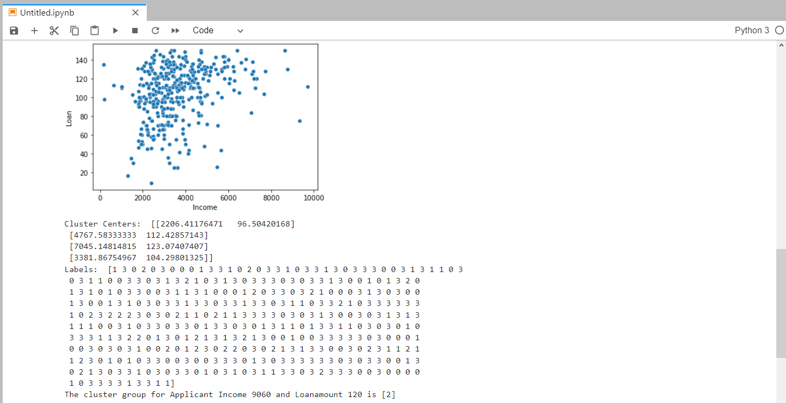

# Implementation of K-Means Clustering Algorithm
## Aim
To write a python program to implement K-Means Clustering Algorithm.
## Equipment’s required:
1.	Hardware – PCs
2.	Anaconda – Python 3.7 Installation

## Algorithm:

Step1:
Import pandas.

Step2:
Import matplotlib.pyplot.

Step3:
Import sklearn.cluster from KMeans module.

Step4:
Import seaborn

Step5:
Import warnings

Step6:
Declare warnings.filerwarning with ignore as argument

Step7:
Declare a variable x1 and read a csv file(clustering.csv) in it.

Step8:
Declare a variable x2 as index of x1 with arguments ApplicantIncome and LoanAmount.

Step9:
Display x1.head(2) and x2.head(2).

Step10:
Declare a variable x and store x2.values.

Step11:
Declare sns.scatterplot for ApplicantIncome and LoanAmount by indexing.

Step12:
Plot Income , Loan and display them.

Step13:
Declare a variable kmean = KMean(n_cluster_centers_) and execute kmean.fit(x).

Step14:
Display kmean.cluster)centers

Step15:
Display kmean.labels_

Step16:
Declare a variable predcited_class to kmean.predict([[]]) and give two arguments in it.

Step17:
Display the predicted_class.

## Program:
```
"Cars.Csv"
V\import pandas as pd
from sklearn import linear_model
import matplotlib.pyplot as plt

df=pd.read_csv("cars.csv")

X=df[['Weight','Volume']]
y=df['CO2']

regr = linear_model.LinearRegression()
regr.fit(X,y)

#Coefficients and intercepts of Model

print('Coefficients: ', regr.coef_)
print('Intercept:',regr.intercept_)

#predict the c02 emission of a car where the weight is 300kg,and the volume is 1300cm3

predictedCO2= regr.predict([[330,130]])

print('Predicted CO2 for the corresponding weight and volume',predictedCO2)

"Clustering.Csv"
import pandas as pd
import matplotlib.pyplot as plt
from sklearn.cluster import KMeans
import seaborn as sns
X1 = pd.read_csv("clustering.csv")
print (X1. head(2))
X2 = X1.loc[:, ['ApplicantIncome', 'LoanAmount' ]]
print(X2. head(2))
X = X2.values
sns.scatterplot(X[:,0], X[:, 1])
plt.xlabel('Income')
plt.ylabel('Loan')
plt.show( )
kmean=KMeans(n_clusters=4)
kmean. fit(X)
print('Cluster Centers: ',kmean.cluster_centers_)
print('Labels: ',kmean.labels_)
# predict the class for ApplicantIncome 9060 and Loanamount 120
predicted_class = kmean.predict([[9000, 120]])
print("The cluster group for Applicant Income 9060 and Loanamount 120 is",predicted_class)

```
## Output:



## Result
Thus the K-means clustering algorithm is implemented and predicted the cluster class using python program.
